# CS410: Portfolio Optimization

Assignment for PKU Network Information Architecture (网络信息体系结构) 2021 spring.

Given the TOP50 stocks (A-share) with heavy public offerings in the first quarter of 2021, determine the efficient frontier and optimal portfolio.

## Introduction


## Prepare environment
```
conda create -n cs410 python=3.6
conda activate cs410
conda install pytorch torchvision cudatoolkit=10.0 -c https://mirrors.tuna.tsinghua.edu.cn/anaconda/cloud/pytorch
pip install -r requirements.txt 
```

## Optimization Model

<details>
<summary>1. Mean-Variance Optimization</summary>

- [Mean-Variance.py](Mean-Variance.py)

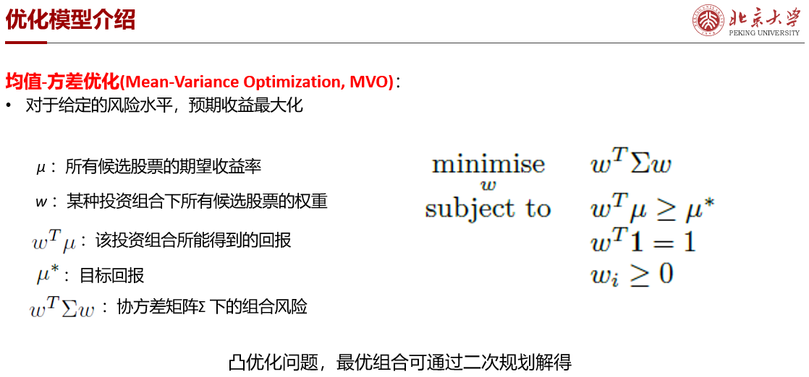
</details>

<details>
<summary>2. Capital Asset Pricing Model</summary>

- [CAPM.py](CAPM.py)

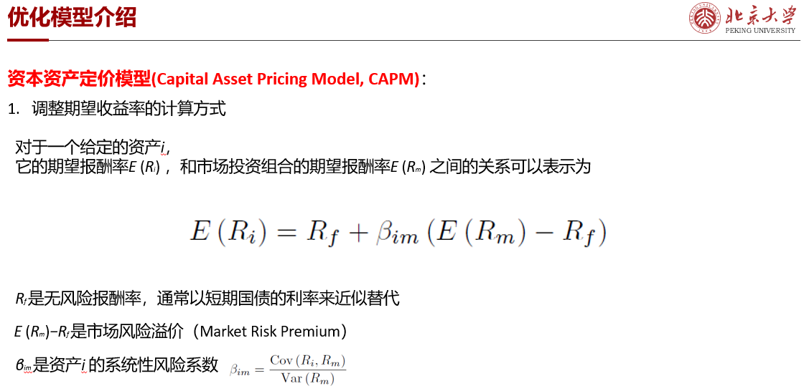
</details>

<details>
<summary>3. Neural Network</summary>

- [nn.ipynb](nn.ipynb) & [NN.py](NN.py)

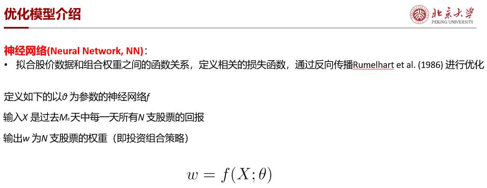
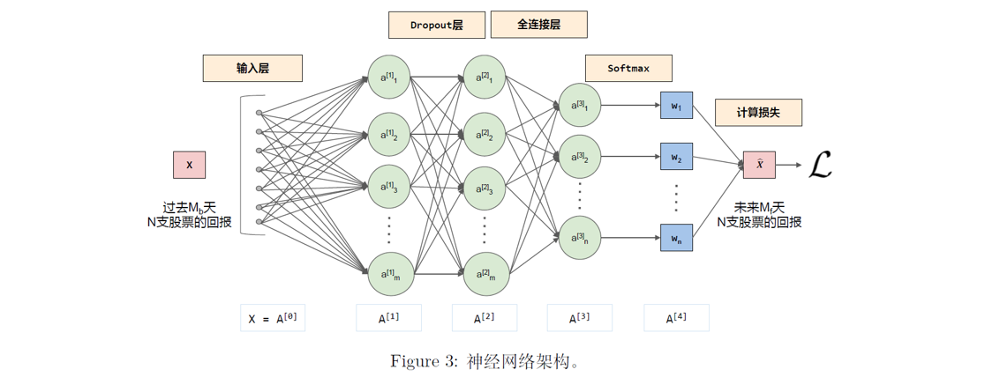
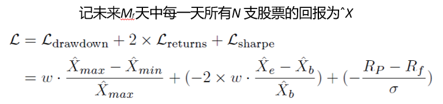
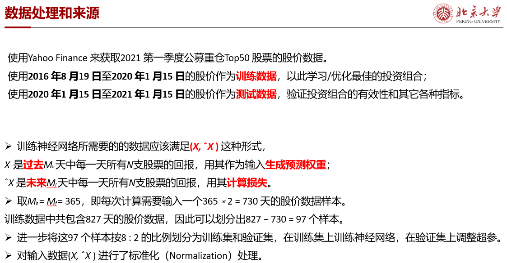
</details>

## Evaluation

- [evaluation.py](utils/evaluation.py)

## Visualization

- [visualization.ipynb](utils/visualization.ipynb)

## Results

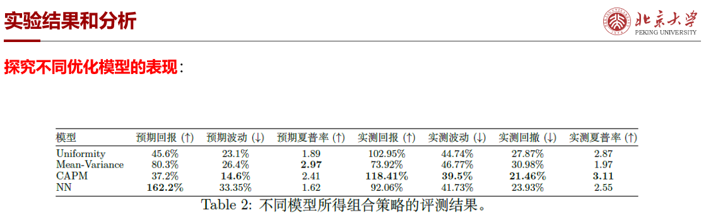
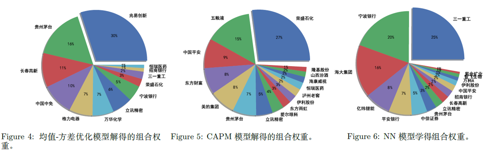
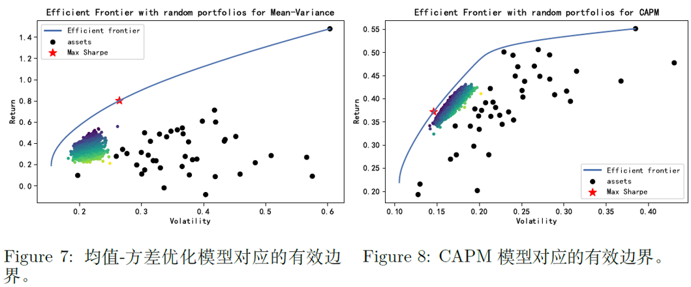
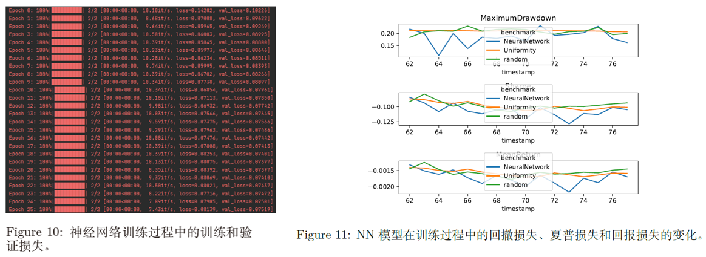
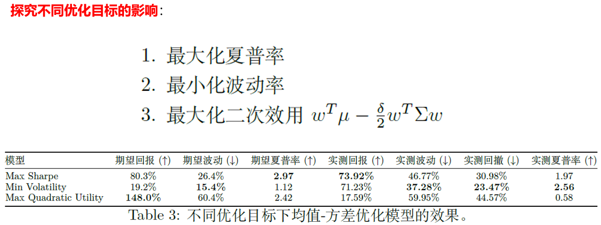
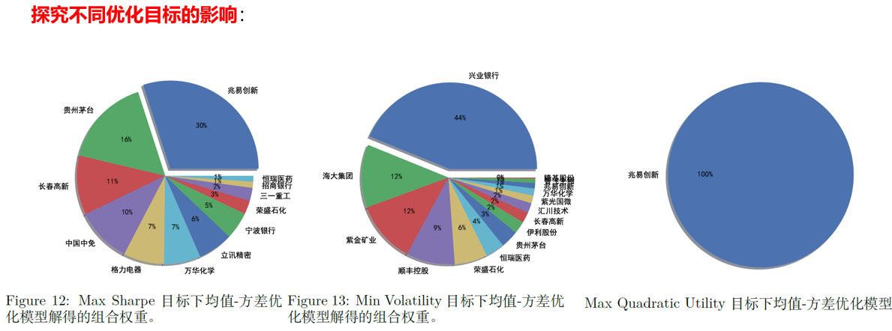